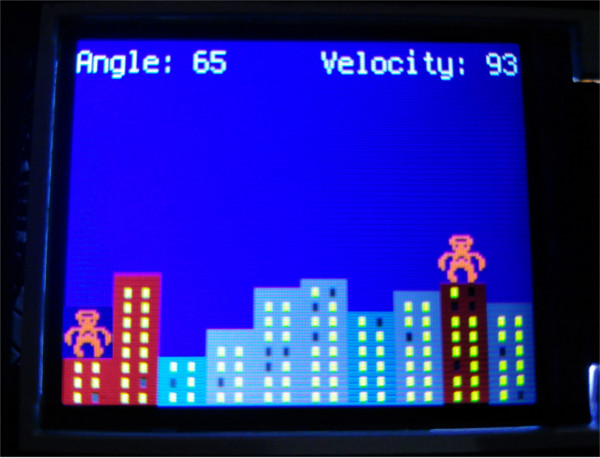

## Circuit Python Gorillas

This is a Circuit Python implementation of an old QBasic game called [Gorillas.bas](https://www.google.com/search?hl=en&q=gorillas.bas) It's was developed for the PyGamer device, but should work on PyBadge and perhaps some others.

It's a two player game, both players take turns throwing bananas at each other. If the bananas hit the buildings in the skyline they will take chunks out of he buildings, eventually being able to pass all the way through.

## Installation Instructions
- Backup your existing `code.py` file under a different name.
- Copy the files `banana.py`, `player.py`, `gorillas.py`, `gorilla_all.bmp`, and `banana_all.bmp` onto your device `CIRCUITPY` drive.
- Rename `gorillas.py` to `code.py`

## Game Controls
To throw a  banana you select numbers for an angle and a velocity.

Up and Down on the D-Pad / Joystick will move the current number up or down respectively.

The A button will select the currently shown number. 

After selecting velocity the banana will be thrown.